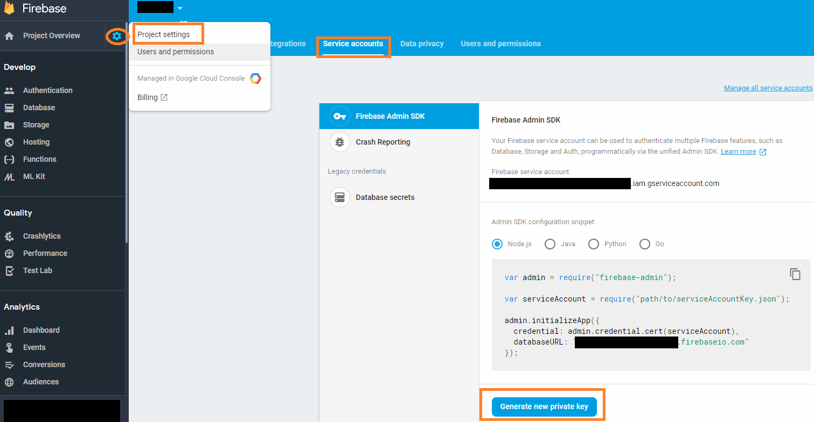

## Switch Firebase project instances for Test / Development / Staging / Production

## Setup
    
#### 1. Create a `keys` folder to contain project credentials and ensure it's excluded from GIT source control.

    $ mkdir ./keys
    $ echo keys/ >> .gitignore
    
#### 2.  Login to Firebase Console and create your Test / Development / Staging / Production projects

#### 3.  Generate and download service keys for each project.

Save each Private Key file as a JSON file under file names that match their respective project-id.
    
Example file names:

    ./keys/myapp-test.json
    ./keys/myapp-dev.json
    ./keys/myapp-stage.json
    ./keys/myapp-prod.json



#### 4.  Assign each project a local alias (saved in `.firebaserc` file)

    $ firebase use --add

Example `.firebaserc`

```
{
 "projects": {
   "test": "myapp-test",
   "dev": "myapp-dev",
   "stage": "myapp-stage",
   "prod": "myapp-prod"
  }
}
```

#### 5. Now use `firebase-env.sh` to switch Firebase projects.

This script runs `firebase use <alias>` and then sets and exports 
environment variables so must be run with a ". " prefix.

    $ . ./firebase-env.sh [test|dev|stage|prod]

This will set the following variables that match those pre-configured on Firebase/GCP servers.

```
$GOOGLE_CLOUD_PROJECT
$GOOGLE_APPLICATION_CREDENTIALS
$FIREBASE_CONFIG
```

#### 6. Remove credentials and project specific values from your code.

Now your Cloud Functions code and CI scripts need not contain any references to credentials or project specific values.

```
import * as admin from 'firebase-admin';

// Uses $GOOGLE_APPLICATION_CREDENTIALS and $FIREBASE_CONFIG
const adminApp = admin.initializeApp();  
```

adminApp.options implements the `AppOptions` interface that intended for server-side services.
- `apiKey` and `messagingSenderId` are only required in client-side apps.

```
// 

  interface AppOptions {
    credential?: admin.credential.Credential;
    databaseAuthVariableOverride?: Object;
    databaseURL?: string;
    serviceAccountId?: string;
    storageBucket?: string;
    projectId?: string;
    httpAgent?: Agent;
  }
```


## Related Information

- [Firebase: Environment configuration](https://firebase.google.com/docs/functions/config-env)
- [Firebase: Separating configuration from code in Admin SDK - Medium](https://medium.com/google-cloud/firebase-separating-configuration-from-code-in-admin-sdk-d2bcd2e87de6)

- [Using JSON in config:set](https://github.com/firebase/firebase-tools/issues/406)

If you're running a CI Pipeline you might want to have a look at:

- [firebase-ci: A Simplified Firebase interaction for continuous integration](https://github.com/prescottprue/firebase-ci)

- [Firebase Data Within A Team and RTDB](https://tech.residebrokerage.com/firebase-data-within-a-team-fb05c02b184)
  - Developed [FireAdmin](https://github.com/prescottprue/fireadmin) tool.
  - [Managing Firebase Data — An Intro To Fireadmin](https://medium.com/@prescottprue/managing-firebase-data-an-intro-to-fireadmin-fb0ecc930d1c)

- [Automatically deploy to Firebase with GitLab CI](https://medium.com/evenbit/automatically-deploy-to-firebase-with-gitlab-ci-546f194c44d8)

- [Import / Export user accounts into Firebase projects](https://firebase.google.com/docs/cli/auth)
- [Multi-instance deployment (multiple sites/databases)](https://firebase.google.com/docs/cli/targets)
- [Firebase Schema Evolution](https://medium.com/@wcandillon/firebase-schema-evolution-ea830a62c14e)
